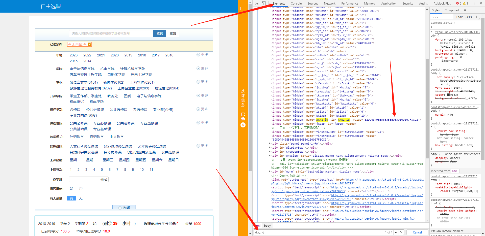
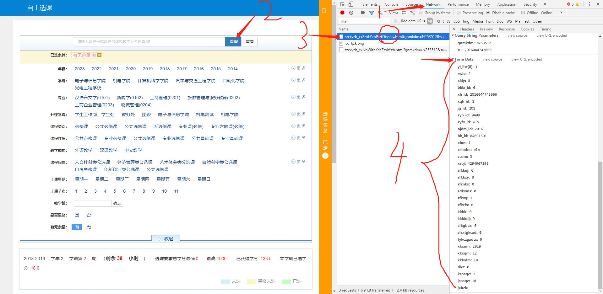

# 正方教务系统查询程序
# 欢迎来到小火车的神奇世界
~~(好的我顺利推销了一波B站的账号)~~

###前言
    这些东西仅仅是用来满足我的求知欲和好奇心的，我是一个python初学者，
    刚好遇到师弟师妹抢课，所以就写了这么一个东西，其实功能很废物的，
    如果你只是想拿来抢课的话，我建议别用我这个了，功能极度不完善。
    如果你是想拿来学习爬虫或者是python，那你可以研究研究，反正代码很简单
#####最重要的一点是，如果你觉得我写得不够好或者是极度垃圾，请不要再看下去了，我只是提供一个思路罢了，厉害的人多的是，我只是初学者

###准备工作
先准备好以下几点：
1. 用户名
2. 密码
3. xkkz_id
4. userData
5. 完整的运行环境(包括：python3.7，selenium库，requests库，re库)
6. 和驱动程序相匹配版本的Chrome
6. 一定的python基础
7. 足够的耐心和好奇心和求知欲

具体怎么做呢？

#### 用户名和密码：
这个你自己想吧23333

#### xkkz_id：
1. 使用谷歌浏览器打开这个界面
2. 按F12
3. 打开Element，Ctrl+F搜索xkkz_id
4. 复制那段代码，这段代码就是xkkz_id

#### userData:
1. 使用谷歌浏览器打开这个界面
2. 按F12，打开Network
3. 点击查询
4. 找到图中的文件，单击
5. 看From Data里的数据，对应着把我的程序里的数据改掉，记得是str型
6. 我推荐把jspage设置为20或者30，意思是一次性获取这么多个课并输出列表

